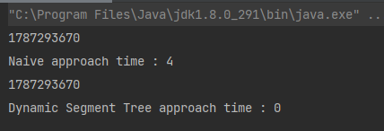
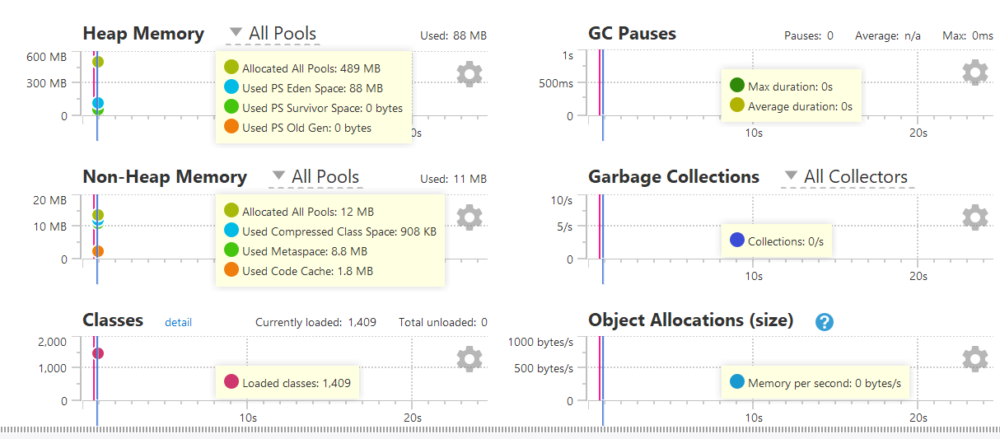

Problem:

Algorithm:

we will introduce some algorithms and provide a benchmarking and profiling of cpu and memory.

# 1. Naive approach:

algorithm:

The naive approach is to iterate over the array when we need to sum the range of the array from index l to r.

Updating the array in index i, simply we put A[i] = x

java code:

yourkit performance:

# 2. Dynamic Segment Tree:

Motivation:

A dynamic segment tree is a variation of the traditional segment tree data structure that allows for efficient modification of the underlying data. In contrast to the static segment tree, which is constructed once and cannot be modified, a dynamic segment tree can be constructed and modified at runtime, which makes it useful in scenarios where the data is changing frequently.

# Difference between the two approaches in times

see this times that exist in the code:

performance:

